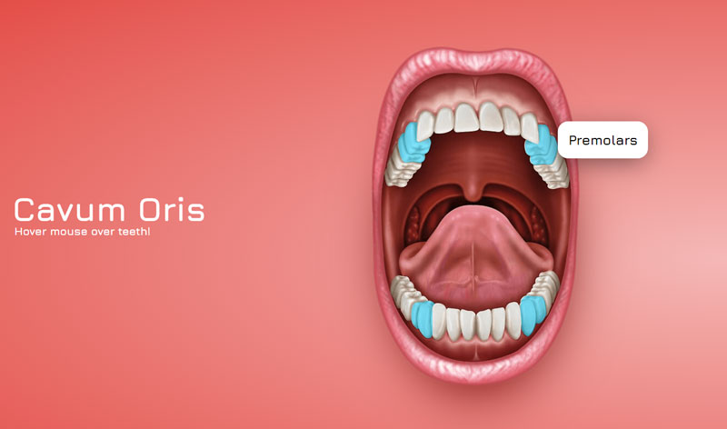

This was a little test about how to create hotspots on an image and show some info for the according hotspot.

A little obstacle in this case was the fact, that there where coherent hotspots in the top and the bottom of the mouth, which needed to be highlighted both when you hover on one side. This made it impossible to use normal images, because they would have overlap other hotspot images, which whould make them inaccessible.

Thats why I went with an inline SVG image, where I can manage each element of the SVG by calling the class/id.
